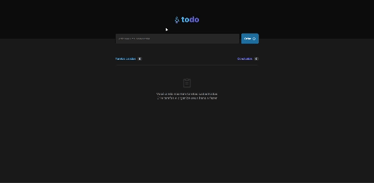
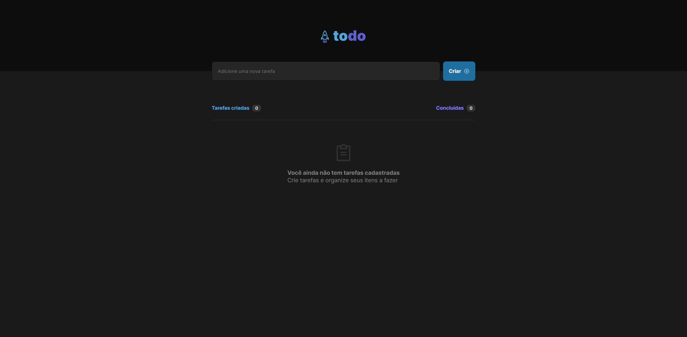
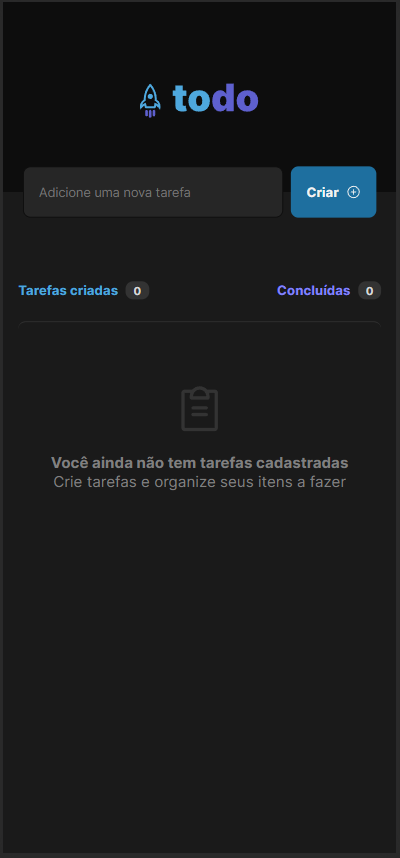

# Sobre o ToDoList:

### Preview

O projeto ToDoList busca trabalhar conceitos dentro do React
como:

- Estados
- Imutabilidade do estado
- Listas e chaves no ReactJS
- Propriedades
- Componentização

### Fucionalidades do Projeto

- [x] Adicionar uma nova tarefa
- [x] Marcar e desmarcar uma tarefa como concluída
- [x] Remover uma tarefa da listagem
- [x] Mostrar o progresso de conclusão das tarefas
- [x] Armazenamento utilizando LocalStorage

<!-- [Projeto disponível](https://projetocss-jesscoder.netlify.app/) -->

### Linguagens e Ferramentas

- React
- Vite
- Figma
- LocalStorage

## Layout

### Desktop

### Mobile

[Figma do Projeto](<https://www.figma.com/file/ZuNFy2kjrKdlUw0xnPtUui/ToDo-List-%E2%80%A2-Desafio-React-(Copy)?type=design&node-id=0%3A1&mode=dev>)

### Autor

[Licenca MIT License](http://creativecommons.org/licenses/by)
